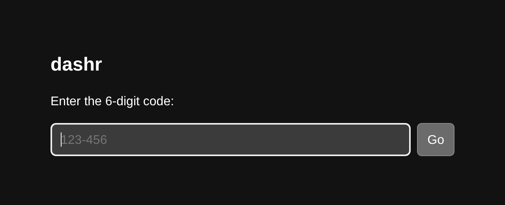

# dashr

A small, self-hosted URL shortener built around 6-digit numeric codes — the kind you'd put on a slide, read aloud, or print on a flyer. Codes look like `456-767`. Type one in at the site root, or follow `https://your.site/456-767` directly.

```
+-----------------+              +-----------------+
|   your.site/    |              | your.site/456-  |
|                 |  --or-->     | 767             |
|  [ 456-767 ] Go |              |                 |
+-----------------+              +-----------------+
                                          |
                                          v
                              https://wherever-you-pointed-it
```



Built for low volume (the namespace is one million codes; you'll use a tiny fraction). No framework, no Composer, no build step. PHP + SQLite, ~600 lines total.

## Features

- 6-digit numeric codes, displayed as `XXX-XXX`. Inputs accept either form.
- Public landing page with a code-entry form.
- Direct `/{code}` URLs work too.
- Admin web UI for creating, listing, and deleting links. Password protected.
- JSON API for programmatic creation. Bearer-token authenticated.
- Optional custom codes when creating (reserve `123-456` for a specific URL).
- CSRF on all admin POSTs; constant-time comparison for tokens; `Secure`/`HttpOnly`/`SameSite=Lax` session cookies.

## Requirements

- PHP 8.2+ (with `pdo_sqlite`, `curl`)
- A web server pointing at `public/` (built-in `php -S`, nginx, Apache, Caddy, Forge — anything works)
- SQLite (bundled with PHP)

No Composer, no Node, no extra runtime.

## Quick start (local)

```bash
git clone <your-fork> dashr
cd dashr
cp .env.example .env

# Generate an admin password hash and an API token
php -r 'echo password_hash("yourpassword", PASSWORD_BCRYPT) . "\n";'
php -r 'echo bin2hex(random_bytes(24)) . "\n";'

# Paste those values into .env, then:
php -S 127.0.0.1:8000 -t public
```

Open <http://127.0.0.1:8000/>, log in at <http://127.0.0.1:8000/admin>, and create your first link.

## Configuration

All config is environment variables, loaded from a `.env` file at the project root.

| Variable | Required | Description |
|---|---|---|
| `ADMIN_PASSWORD_HASH` | yes | Bcrypt hash of the admin password. |
| `API_TOKEN` | yes (for API) | Bearer token compared against the `Authorization` header. Generate with `bin2hex(random_bytes(24))`. |
| `BASE_URL` | yes | Public URL with no trailing slash, e.g. `https://links.example.com`. Used to build the `short_url` in API responses. |
| `SITE_NAME` | no | Header shown on the public entry page and the browser title. Defaults to `dashr`. |

See `.env.example` for the canonical template.

## API

```bash
# Create with auto-generated code
curl -X POST https://your.site/api/links \
  -H "Authorization: Bearer $API_TOKEN" \
  -H "Content-Type: application/json" \
  -d '{"url":"https://example.com"}'
# → {"code":"456-767","short_url":"https://your.site/456-767"}

# Create with a custom code
curl -X POST https://your.site/api/links \
  -H "Authorization: Bearer $API_TOKEN" \
  -H "Content-Type: application/json" \
  -d '{"url":"https://example.com","code":"123-456"}'
```

Status codes: `200` on success, `400` on bad input, `401` on missing/wrong token, `409` on duplicate code.

## Deployment

See [DEPLOY.md](DEPLOY.md) for production deployment, including a Forge-specific walkthrough.

## Tests

```bash
php tests/run.php
```

Sixteen tests covering code parsing/generation, auth helpers, and an end-to-end integration test that spins up the dev server in a subprocess.

## Project layout

```
public/index.php  — front controller
src/
  env.php         — .env loader
  codes.php       — normalize_code, format_code, generate_code
  db.php          — PDO + auto-migration
  auth.php        — session, CSRF, bearer token
  routes.php      — request handlers
views/            — small PHP templates
tests/            — _helpers + glob runner + *_test.php
data/             — SQLite file lives here (gitignored)
```

## License

MIT — see [LICENSE](LICENSE).
